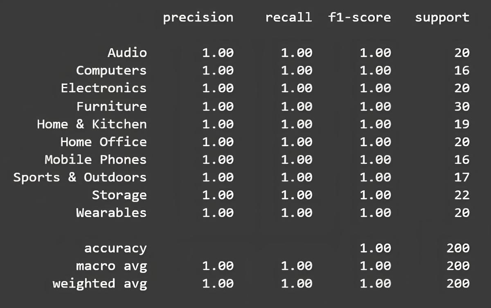
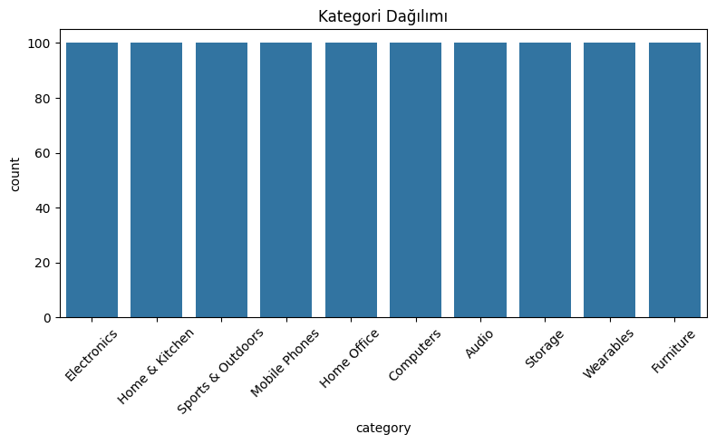
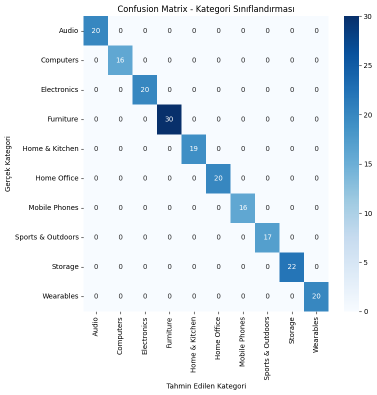
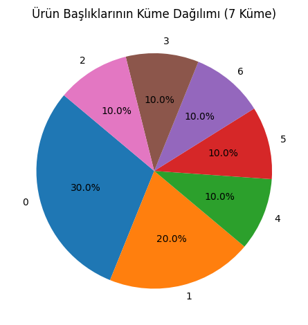
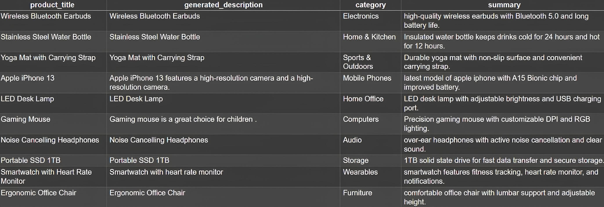

# Product Title-Based Category and Description Generation

Bu projede, e-ticaret ürün verileri üzerinden başlık, açıklama ve kategori alanlarına yönelik
yapay zeka destekli tahmin ve düzenleme adımları uygulanmıştır.

## 🔹 Amaç

1. Ürün başlıklarından anlamlı açıklamalar üretmek
2. Açıklamalara göre ürün kategorisi tahmini yapmak
3. Benzer ürünleri kümelemek (segmentasyon)
4. Uzun açıklamaları T5 modeliyle özetlemek
5. Alternatif olarak, daha gelişmiş metin temsili (embedding) için sentence-transformers ile ürünleri kümelendirmek

---

## 📋 Veri Seti

* **Dosya Adı**: `products_raw_1000.csv`
* **Özellikler**:

  * `product_title`
  * `product_description`
  * `category` (etiketli veri)

> Bu projede kullanılan veri seti, farklı ürün başlıklarının ve açıklamalarının dengeli olacak şekilde manuel ve yarı-otomatik yöntemlerle tarafımdan oluşturulmuştur.  
> Her kategoriye ait 100’er örnek içerecek biçimde tasarlanmıştır.  
> Bu sayede sınıflandırma ve kümeleme algoritmaları üzerinde anlamlı sonuçlar gözlemlenebilmiştir.

---

## 📝 1. Açıklama Üretimi (T5)

* **Model**: [`t5-small`](https://huggingface.co/t5-small) (HuggingFace üzerinden)
* **Girdi**: Ürün başlığı
* **Çıktı**: Doğal dilde üretilmiş açıklama
* **Örnek**:

  * `Title`: *Wireless Bluetooth Earbuds*
  * `Generated`: *High-quality wireless earbuds with Bluetooth 5.0*

---

## 🏷️ 2. Kategori Tahmini (Logistic Regression)

* **Yöntem**: TF-IDF + Logistic Regression
* **Eğitim Verisi**: Ürün açıklaması ve kategorisi
* **Test Doğruluğu**: 1.00 (dengeli ve öğretici veri nedeniyle)
* **Görsel**: Aşağıda verilmiş `classification_report` çıktısına ait tablo ve kategori sınıflandırma tabloları:

### 🧪 Classification Report Output



### 📊 Category Distribution



### 📉 Confusion Matrix - Kategori Sınıflandırması



---

## 📊 3. Kümeleme (Segmentasyon)

* **Yöntem**: TF-IDF + KMeans

* **Küme Sayısı**: 7 (daha dengeli dağılım elde edildi)

* **Çıktı**: Her ürün bir `küme` numarası aldı

* **Örnek**:

  * Küme 0: *Office Chair*, *Desk Lamp*, *Gaming Mouse*
  * Küme 1: *Yoga Mat*, *Smartwatch*

---

### 🧠 Alternatif Kümeleme – Sentence Transformers ile Embedding

Klasik TF-IDF yerine daha semantik anlamı yakalayabilen `sentence-transformers` (örn. `all-MiniLM-L6-v2`) modeli ile ürün başlıkları vektörleştirilmiş ve bu temsiller üzerinden tekrar KMeans kümeleme yapılmıştır.

* Bu yöntem, ürün başlıklarının bağlamını daha iyi kavrayarak daha anlamlı kümeler oluşturmayı hedefler.  
* Embedding temelli kümeleme sonucunda yine 7 küme belirlenmiş, verilerin segmentasyonu görselleştirilmiştir.  
* Model: `sentence-transformers/all-MiniLM-L6-v2`  
* Vektör boyutu: 384

---

### 🎯 Görselleştirme:

- Kümeleme pasta grafiği aşağıda mevcuttur.

### 🍰 Product Title Clustering (7 Clusters)



---

## 📌 4. Özetleme 

* **Model**: `t5-small`
* **Amaç**: Uzun açıklamaları daha okunabilir hale getirmek
* **Uygulama**: İlk 100 açıklama üzerinde uygulanmıştır

### 📋 Example Table: Description and Summary



---

## 🔧 Kullanılan Araçlar

* **Google Colab** (Notebook geliştirme)
* **HuggingFace Transformers** (T5 modeli)
* **scikit-learn** (TF-IDF, KMeans, Naive Bayes)
* **pandas**, **matplotlib**, **seaborn** (veri işleme ve görselleştirme)

---

## 🛠️ Kullanım ve Gereksinimler

Projenin çalışması için aşağıdaki kütüphaneler gerekir:

- pandas
- numpy
- matplotlib
- seaborn
- scikit-learn
- transformers
- torch
- tqdm
- sentence-transformers

Tümünü yüklemek için:

```bash
pip install -r requirements.txt
```
---

## ▶️ Notebook'u Çalıştırma

* **Product_Title_Based_Category_and_Description_Generation.ipynb dosyasını Google Colab veya Jupyter Notebook ile açın**
* **products_raw_1000.csv dosyasını yükleyin**
* **Tüm hücreleri sırasıyla çalıştırın**
* **Çıktı dosyası: products_with_predictions.csv**

---

## 📂 Çıktı Dosyaları

| Dosya Adı                                                        | Açıklama                                      |
| ---------------------------------------------------------------- | --------------------------------------------- |
| `products_raw_1000.csv`                                          | Ham veri                                      |
| `Product_Title_Based_Category_and_Description_Generation.ipynb`  | Geliştirilen notebook                         |
| `products_with_predictions.csv`                                  | Tüm model çıktılarıyla zenginleştirilmiş veri |

---

## 🤝 Katkı

Bu projeye katkı sağlamak isterseniz:

* **Bu repoyu fork'layın**
* **Yeni bir branch oluşturun: git checkout -b feature/ekleme**
* **Değişikliklerinizi yapın ve commit edin**
* **Pull request oluşturun**

Her katkı değerlidir!

---

## 📄 Lisans

Bu proje MIT Lisansı ile lisanslanmıştır. Daha fazla bilgi için LICENSE dosyasına göz atabilirsiniz.

---

## 🚀 Sonuç

Bu proje, yalnızca başlık verisiyle:

* Açıklama üretimi
* Kategori sınıflandırması
* Kümeleme
* Özetleme
  
işlevlerinin başarıyla entegre edilerek uygulanmasını hedefler.
